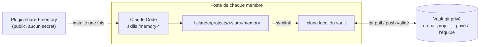
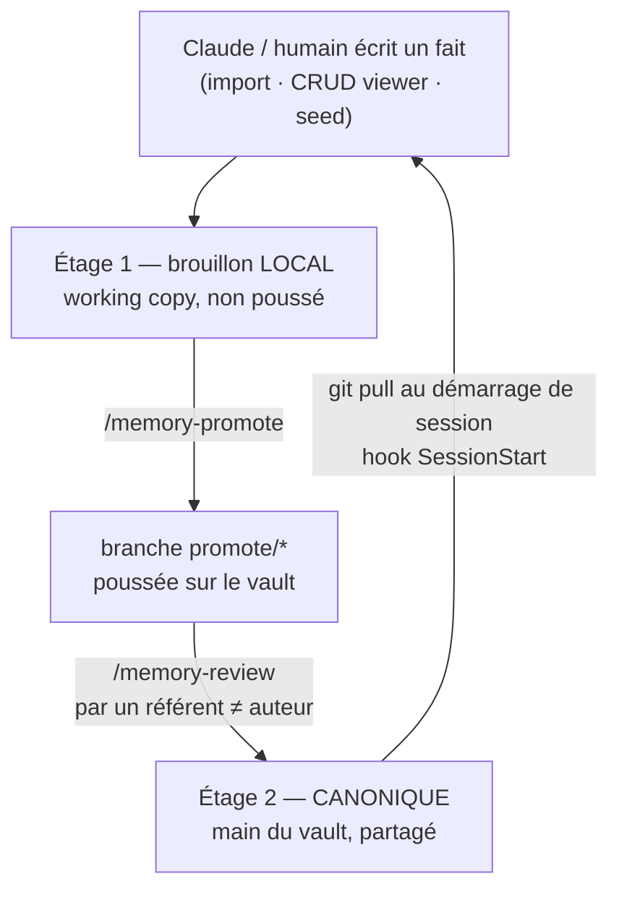
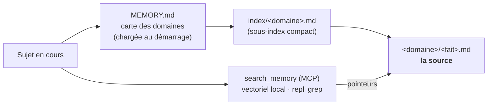

# shared-memory

[](https://github.com/Manguet/shared-memory/actions/workflows/tests.yml)

> **Une mémoire d'équipe partagée par projet, pour Claude Code.**
> Ce que tu apprends à Claude ne reste plus prisonnier de ta machine : toute l'équipe — devs **et**
> vibe coders — partage **une seule source de vérité** par projet, sans application séparée.

---

## Le problème

La mémoire native de Claude Code vit dans `~/.claude/projects/<slug>/memory/` : **locale à chaque
machine**, hors du dépôt, **jamais synchronisée**. Chaque Claude construit son savoir en silo. Les
décisions, conventions et chantiers découverts ne circulent pas dans l'équipe.

**`shared-memory`** branche cette mémoire native, par un simple **symlink**, sur un **vault git
privé** (un par équipe). Dès lors, lire et écrire de la mémoire passe par une source commune,
gouvernée par revue de branche git — le tout **dans Claude Code**, que tout le monde a déjà.

## Comment ça marche



| Repo | Contenu | Visibilité |
|------|---------|------------|
| **plugin** (ce repo) | l'outil : skills, viewer, scripts | **public** (aucun secret) |
| **vault** (un par équipe) | la mémoire : `MEMORY.md` + faits `.md` | **privé** à l'équipe |

La mémoire reste de simples **fichiers `.md`** (frontmatter + corps + liens `[[wikilink]]`) — c'est
ce qui rend le partage possible : **git** fait la synchro, l'historique et les conflits ; on ne
réécrit aucun outil de sync.

## Ce qui est automatique (zéro effort au quotidien)

L'outil est conçu pour **ne pas être chronophage** : tu écris la mémoire, le reste se déclenche
tout seul.

- **🔔 Rappel au démarrage (digest)** — à l'ouverture d'une session, Claude reçoit un **résumé
  d'une ligne par fait** (groupé par domaine). Il **sait** ce que l'équipe a appris et relit le
  fait quand le sujet arrive, **sans que tu aies à le lui demander**. Borné : sur un gros vault, le
  digest retombe sur la carte des domaines + la recherche.
- **🔄 Synchro au démarrage** — le vault est mis à jour (`git pull`) automatiquement ; tu repars
  toujours du savoir le plus récent de l'équipe.
- **📝 Rappel de promotion** — en fin de session (et au démarrage), Claude te signale les faits
  locaux non encore partagés, pour lancer `/memory-promote` au bon moment.
- **🕐 Fraîcheur signalée** — les faits trop vieux (≥ 90 j) sont marqués **`⚠`** : la confiance ne
  s'érode pas en silence.

**Véracité préservée :** le digest et la recherche **aiguillent** ; Claude **relit toujours le
fait** (la source) avant d'affirmer. Le gain de temps ne se paie pas en approximations.

## La boucle de gouvernance (deux étages)

Rien ne devient « officiel » sans une **revue par un référent** — la garantie qualité, surtout avec
des contributeurs nombreux.



- **Étage 1 — local** : Claude (et toi) écrivez librement, sans friction. Les faits perso
  (`type: user`/`feedback`) restent locaux, jamais partagés.
- **Étage 2 — canonique** : seul un **référent** fusionne dans `main` (`/memory-review`). La
  promotion est explicite (`/memory-promote`), jamais automatique.

## Les fonctionnalités

### Skills (à lancer dans Claude Code)

| Skill | Rôle |
|-------|------|
| `/memory-setup` | branche le projet sur le vault (clone + symlink + registre) |
| `/memory-seed` | **amorce** un vault vide depuis tes sources (CLAUDE.md, doc) → brouillons |
| `/memory-import` | normalise un doc brut en **faits atomiques** (+ dédup) |
| `/memory-list` | consulter / chercher dans la mémoire (conversationnel) |
| `/memory-ui` | **viewer web** local : explorer + **CRUD** des faits (créer/éditer/supprimer/déplacer) |
| `/memory-promote` | proposer ses faits à l'équipe (vérifie le code, pousse une branche) |
| `/memory-review` | relire et fusionner les propositions (git seul) |
| `/memory-doctor` | diagnostiquer la recherche sémantique et proposer les installs |

### Sous le capot

- **🔎 Recherche sémantique** — l'outil MCP **`search_memory`** (vectoriel local via *fastembed*,
  **repli grep** si absent) renvoie des **pointeurs** de faits, jamais le contenu : *l'index aiguille,
  le fait est la source*. Claude relit le fait avant d'affirmer.
- **🗂️ Sharding par domaine** — la carte `MEMORY.md` (chargée au démarrage) ne liste que des
  **domaines** ; les faits sont rangés par domaine avec des **sous-index compacts** lus à la demande
  → coût tokens de démarrage **borné** quelle que soit la taille. `reshard.py` redécoupe
  récursivement un domaine trop gros en sous-domaines (prouvé à **9 300 faits**).
- **🖥️ Viewer + CRUD local** — un mini-serveur local (`http://localhost`, lecture seule du contenu,
  **écriture en brouillon étage 1**) : arbre N-niveaux, recherche hybride, créer/éditer/supprimer un
  fait, renommer un domaine — sans jamais toucher au canonique.
- **🔄 Boucle vivante (hooks)** — au **démarrage de session** : **digest** des faits (rappel
  automatique, cf. ci-dessus) + synchro automatique du vault + rappel des faits non promus ;
  **rappel en fin de session**. Best-effort, jamais bloquant.
- **🕐 Fraîcheur** — chaque fait porte une date `reviewed` ; le viewer signale les faits **périmés**
  (≥ 90 j ou jamais vérifiés) → la confiance ne s'érode pas en silence.
- **🧬 Dédup sémantique** — à la création, un fait trop proche d'un existant (cosine ≥ 0.80) est
  **signalé** : on met à jour plutôt qu'empiler un doublon.
- **🔒 Sûreté** — faits perso `gitignore`és (jamais poussés), serveur lié à `127.0.0.1` + jeton
  same-origin, validation anti-traversal, CI sur chaque push.

## Recherche & rappel — comment un fait remonte



## Installation

**Guide complet pas-à-pas (devs + non-devs)** : [`INSTALL.md`](INSTALL.md).

Le repo plugin est **public** (aucun secret). Installation par script, **locale**, sans publication
dans aucun catalogue :

```bash
curl -fsSL https://raw.githubusercontent.com/Manguet/shared-memory/main/install.sh | bash
```

Le script vérifie les prérequis, clone le plugin dans `~/.shared-memory/plugin`, et affiche les
commandes `/plugin` à coller dans Claude Code (ajout par **chemin local**, puis `/reload-plugins`).

## Démarrage

```bash
# Dans un projet déjà ouvert dans Claude Code :
/memory-setup git@github.com:<org>/<projet>-memory.git   # brancher le vault
/memory-seed                                             # amorcer depuis CLAUDE.md + doc
/memory-ui                                               # explorer / gérer les faits
# … travail … puis en fin de session :
/memory-promote                                          # proposer ses faits (branche git)
```

## Prérequis

- `git` authentifié (accès au vault privé), `python3`.
- **Optionnel** : `fastembed` (`pip install fastembed`) pour la recherche sémantique ; sans lui,
  **repli automatique sur grep** (`/memory-doctor` propose l'install).

## Structure du repo

```
shared-memory/
├── .claude-plugin/         plugin.json, marketplace.json
├── .mcp.json               déclare le serveur MCP (search_memory)
├── .github/workflows/      CI (unittest au push)
├── skills/                 memory-setup · -seed · -import · -list · -ui · -promote · -review · -doctor
├── scripts/
│   ├── lib.sh, setup-vault.sh, view.sh, doctor.sh, hook-memory.sh   bash : setup, viewer, prérequis, hooks
│   ├── build-viewer.py, serve-viewer.py                             viewer : lecture + serveur http + CRUD
│   ├── sm_paths.py, embed.py, mcp-server.py, doctor.py, similar.py  recherche : embeddings, MCP, dédup
│   └── reshard.py, gen-synth-vault.py, verify-scale.py              sharding récursif + vérif à l'échelle
├── assets/                 viewer-template.html, fact-template.md
├── tests/                  unittest (viewer, embeddings, MCP, doctor, reshard, hooks, dédup, …)
└── docs/                   ARCHITECTURE.md, domain-convention.md, superpowers/ (specs & plans)
```

## Documentation

- 📐 [`docs/ARCHITECTURE.md`](docs/ARCHITECTURE.md) — la conception complète (principes, deux étages,
  multi-vault, viewer, recherche, hooks, fraîcheur, dédup, amorçage).
- 🗂️ [`docs/domain-convention.md`](docs/domain-convention.md) — la convention de sharding : carte,
  sous-index compacts, profondeur récursive, `reviewed`, garde-fous.
- 🚀 [`INSTALL.md`](INSTALL.md) — installation pas-à-pas (admin + chaque membre).
- 🧭 [`docs/superpowers/`](docs/superpowers/) — l'historique de conception : un **spec** + un **plan**
  par chantier (sharding, viewer, recherche/MCP, reshard, CRUD, hooks, fraîcheur, dédup, amorçage…).
